# AR Drawing with Object Tracking
###### Created by Dan Salerno in Summer 2017
This program is an AR drawing tool where you can draw over the video capture of a webcam in Python using OpenCV. This demonstrates various uses of OpenCV including object detection using color, basic UI and interactivity elements, and image overlaying.

This program runs on Python 2.7 with OpenCV version 3.2. Installation instructions for OpenCV on Windows can be found on the OpenCV website [here](http://opencv-python-tutroals.readthedocs.io/en/latest/py_tutorials/py_setup/py_setup_in_windows/py_setup_in_windows.html). Various guides can be found online for Mac and Linux distros.

This documentation will go over how the code works and how to use the program.

# Code
This section will be split up into the following areas:
* Object Detection
    * HSV vs RGB Color System
    * Thresholding
    * Denoising
    * Contours and Moments
* Image Overlays
    * Drawing
    * Overlay
* UI and Interactivity
    * Video Capture
    * Window Management
    * Mouse events and callbacks
    * Sliders  
    * Keyboard
    
## Object Detection
Object detection can be done in a multitude of different ways. For detecting specific objects, like faces or handwriting, things like [Haar Cascades](http://docs.opencv.org/trunk/d7/d8b/tutorial_py_face_detection.html) or some form of [machine learning](http://opencv-python-tutroals.readthedocs.io/en/latest/py_tutorials/py_ml/py_svm/py_svm_opencv/py_svm_opencv.html#svm-opencv) can be used. However, for this application, a simpler but more general and variable approach involving color. This applications allows the user to use the HSV color system to select a colored object to track. Some thresholding and denoising functions are performed until we have a mask that contains only the object the user wants to track. With contours and moments we can then track the object through frames and overlay helpful markers for the user so they know where they are drawing. All of this will be explained, including code snippets, in the next few sections.
### HSV vs RGB Color Systems
| RGB                    | HSV                    | 
| :--------------------: | :--------------------: |
| 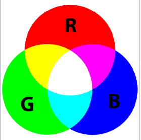 | 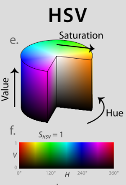 |


Most people who have worked with computers know of the RGB color system, where each pixel is composed of values for Red, Green, and Blue. Each value has a range of 0 to 255, with 0 being the darkest and 255 being the brightest. More info can be found [here](https://en.wikipedia.org/wiki/RGB_color_model). However, you may not know about another color model called HSV, which stands for Hue, Saturation, and Value. This color model is more common in color pickers and editing software, but has various uses for computer vision applications as well. HSV is a cylindrial color model, and more info can be found [here](https://en.wikipedia.org/wiki/HSL_and_HSV). For this application, we use the HSV color system as a way to break the frames coming in from the camera into just the object we are trying to track. This is accomplished by setting the Hue value to the color of the object we are trying to track, then adjusting the Saturation and Value numbers in order to filter out the rest of the image, leaving us with the object we want to track. This process will be more explained in the section about how to use the application. 

Since computers use the RGB color system, when we pull frames off the camera using OpenCV, they are in an RGB format (actually BGR, but its essentially the same). Thankfully, OpenCV makes moving between various color systems extremely easy. You will see lines of code like this
```python
hsv = cv2.cvtColor(frame, cv2.COLOR_BGR2HSV)
```
throughout this code or any other OpenCV code. The `cv2.cvtColor` function takes in an image as its first argument and a defined constant representing a color space as the second argument. The function converts the image to that color space and returns the converted image. 

The actual process for selecting the HSV values to correctly is more involved than it seems, for a few reasons. First, OpenCV uses a slighly strange HSV configuration, where the Hue values range from 0 to 180, with Hue values corresponding to Red being wrapped around and occurring both around 0 and 180. Next, we can't just set the Hue value to one static value and expect the object we are tracking to be completely captured by that value. Instead we need have a range of Hue values to consider in our color defining range. The relevant code for this is:
```python
#calculate upper and lower ranges of the threhsolds
lbr = hue - selectorRange
ubr = hue + selectorRange
#opencv hue values go from 0 to 180 and wrap, so this is the logic to handle the wrapping
if lbr < 0:
    lbr = 180 - selectorRange + hue
    ubr = 180
if ubr > 180:
    ubr = hue - 180 + selectorRange
    lbr = 0
```
The wrapping is handled in those `if` statements. Essentially, if the Hue value is close to 0 and the range causes it to go below 0, we instead wrap the values we are selecting into the 170-180 range of Hue, and vice versa if the value we are selecting goes over 180.
### Thresholding
After we have the Hue value of the object we want to track, we still need to consider how the Saturation and Value numbers interact with selecting an object. This can be easily explained using a few images (or by playing around on [this website](http://alloyui.com/examples/color-picker/hsv/)). 

If we want to track a blue object, this is a blue Hue with max Saturation and Value. 

By lowering the Saturation number, we get this. 

By lowering the Value number, we get this. 

Now depending on the object you are tracking, the distance from the camera, and the light levels you have in the environment, the object you are tracking may have portions that are all these colors. Therefore, we need to create some kind of **threshold** in order to take a range of HSV values out from our camera frame to track the object. Luckily, the application has HSV sliders that allow you to tune the threshold until you can track whatever object you want. 

Getting the upper and lower bound for the Hue value was covered in the last section. The sliders for Saturation and Value are used as lower bounds for the threshold, with upper bounds being 255 (the max for Saturation and Value).

In the code, we create 2 numpy arrays that hold the HSV triples for the upper and lower bound here:
```python
#define hsv ranges for object to track
lowerColorThresh = np.array([lbr, saturation, value])
upperColorThresh = np.array([ubr, 255, 255])
```
To actually take our webcam image (which we have already converted to the HSV color space) and get the resultant **mask** that contains only the object we want to track, we use a single function from OpenCV:
```python
threshMask = cv2.inRange(hsv, lowerColorThresh, upperColorThresh)
```
Here's an example of the frame from the webcam tracking a green marker. 

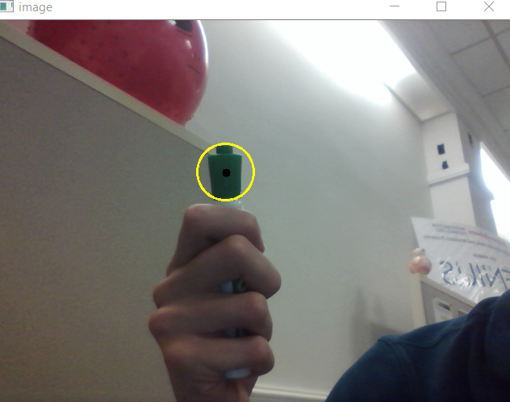

And here is what the mask looks like after some experimenting with HSV values for the threshold. 

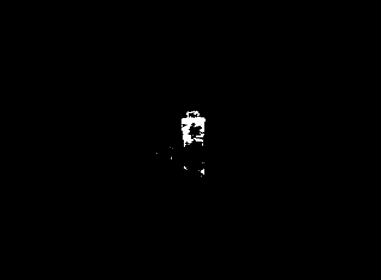

As you can see, the specific HSV thresholding range has managed to only capture the cap of the marker (along with some noise that will be removed in the next section). For the rest of the processing for the frame, we now have an image that only contains the object we want to track. We will use this image in the Contours and Moments section to do more tracking operations later.
### Denoising
If we include just 2 more lines of code to our thresholding process, we can convert the mask for the green marker you just saw to this. 

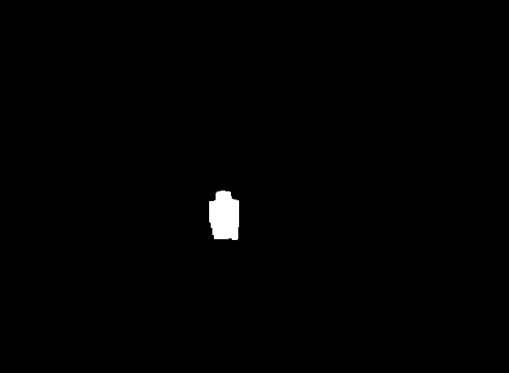

The two lines of code added are methods of denoising the image. The original low quality mask did capture the cap of the green marker, but there were some gaps as well as some small pixels captures outside of the green cap. The two methods of denoising are called **erode** and **dilate** (both of which and more can be found [here](http://docs.opencv.org/3.0-beta/doc/py_tutorials/py_imgproc/py_morphological_ops/py_morphological_ops.html))

**Erosion** is a method to remove some of the boundary of an object. A sliding window moves around the object, centering at each pixel. Each pixel stays white only if every pixel in the sliding window is also. This is useful to remove the small pixels surrounding the object we want to track.

**Dilation** performs the opposite of erosion by using a sliding window centered at a pixel, except now the pixel stays white if any of the the other pixels in the window is white. This is used after erosion, since erosion shrinks the image we want, so the dilations allows us to increase the size of the image we just shrinked, but without the extraneous pixels around the object we dont want. This can also help fill in small gaps in the object we want to track.

OpenCV provides functions for both erosion and dilation (as well as other denoising methods), and the code is as follows:
```python
threshMask = cv2.erode(threshMask, None, iterations = 2)
threshMask = cv2.dilate(threshMask, None, iterations = 2)
```
We pass `None` in for the second element in order to just use the default OpenCV sliding window, but we could define our own window to better adjust its size. The `iterations` parameter allow us to run the erosion/dilation multiple times for better denoising, but at a tradeoff of a degradation of the original image. For this application, we ran 2 iterations because the effects of extra noise pixels and unfilled objects were more detrimental than a slight degradation of the image we are tracking.
### Contours and Moments
Now that we have a binary image that contains only the object we want to track, we can use contours and moments in order to define regions that contain the tracked object.

A [**contour**](http://docs.opencv.org/3.2.0/d4/d73/tutorial_py_contours_begin.html) is a curve joining all the continuous points (along the boundary) of an image that have the same color. In our case, the contour would then be a curve that surrounds our tracked image within the mask we created. This is again done using just one function from within OpenCV:
```python
bcontours = cv2.findContours(threshMask.copy(), cv2.RETR_EXTERNAL, cv2.CHAIN_APPROX_SIMPLE)[-2]
```
This function has a few parameters and things to note:
* We use `threshMask.copy()` rather than just  `threshMask` because this contour function modifies the source image, so we pass in a copy in case we need the unmodified image later.
* `cv2.RETR_EXTERNAL` is the contour retreival mode (which you don't need to understand how it works)
* `cv2.CHAIN_APPROX_SIMPLE` helps simplify how the contours are stored. This method removes redundant points within the contour object (i.e. instead of storing all points on a line, it just stores the start and end point)
* `[-2]` is a baskwards compatibility correction for other versions of OpenCV and Python

Another important bit of code regarding contours is:
```python
c = max(bcontours, key = cv2.contourArea)
```
In case we don't have a clean mask as shown in the previous screenshot, this line will calculate all the contours in the image (which may include tiny contours from some noisy pixels still on the mask) and will keep the largest contour for later processing. The largest contour is most likely the object that we are trying to track. 

You also may have noticed that a yellow circle is drawn around the object that we are tracking. OpenCV provides the following function:
```python
((x, y), radius) = cv2.minEnclosingCircle(c)
```
This will take the contour `c` (the object we are tracking) and give us the smallest circle that completely encloses the contour. There are a [bunch](http://docs.opencv.org/trunk/dd/d49/tutorial_py_contour_features.html) of different functions to draw various shapes that enclose contours.

A [**moment**](https://en.wikipedia.org/wiki/Image_moment) is a certain weighted pixel average of an image. There are many different kinds of moments and uses for them, but this application uses moments to calculate the center of the object we are tracking. The process is described [here](http://docs.opencv.org/trunk/dd/d49/tutorial_py_contour_features.html), but in short, we calculate the M00, M01, and M10 to calculate the centroid of the object, which are the X and Y coordinates of the center of an object (similar to the center of mass of an object). Again, OpenCV provides all the functions to calculate moments and the centroid:
```python
#get the moments of the contour in order to calculate the center of the contour
M = cv2.moments(c)

if M["m00"] == 0:
    glCurrentCenter = (0, 0)
else:
    glCurrentCenter = (int(M["m10"] / M["m00"]), int(M["m01"] / M["m00"]))
```
The only thing that to consider here is that the M00 moment may be 0, but we are dividing by that, so if the M00 moment is 0, we just set the centroid to be (0, 0)

We know know how to track an object in OpenCV! The next step is learning how to use our tracked object in order to draw an image and overlay it on top of our frames from the camera.
## Image Overlays
The drawing function of this application is a two step process. First, we use the contours and centroid to draw on a separate image, then we overlay that image on top of the newest frame from the camers.
### Drawing
All the drawing is handled through just two variables, `glCurrentCenter` and `glLastCenter`. As their name suggests, these variables keep track of the current and last center of our tracked object. We also have an image, `glImg`, which is the same size as the frame coming in from the camera. We use this image to keep track of the lines being drawn by the user. Line drawing is accomplished like this:
```python
#draw on the screen
if (glDrawing and glCurrentCenter != None and glLastCenter != None):
    cv2.line(glImg, glLastCenter, glCurrentCenter, (b, g, r), lineWidth)
```
* The if statement makes sure that we want to draw at this time.
    * `glDrawing` is used in the mouse callback (will be discussed later)
    * `glCurrentCenter != None` makes sure that we currently have an object to track on screen
    * `glLastCenter != None` is also needed because we need 2 points to draw a line, so we need the tracked object to be on screen for at least 2 frames.
* The `cv2.line` function takes
    * `glImg`: the image to draw on
    * `glLastCenter` and `glCurrentCenter`: the two points to draw a line between
    * `(b, g, r)` and `lineWidth`: The color and width of the line to draw (taken from sliders which are covered later)
    
After a bit of drawing, your frame looks like this.
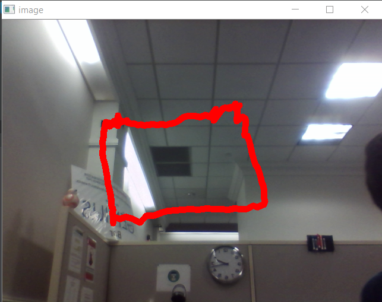

But the underlying image just looks like this
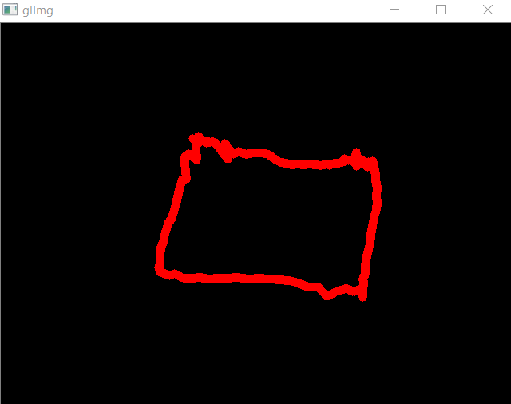

So how does this get overlayed with the frames from your camera?
### Overlay
The image overlaying function is as follows (also explained [here](http://docs.opencv.org/3.0-beta/doc/py_tutorials/py_core/py_image_arithmetics/py_image_arithmetics.html#bitwise-operations):
```python
#NOTE: img2 must not be bigger than img1
def overlay(img1, img2):
    #create roi in case they are not same size
    rows, cols, channels = img2.shape
    roi = img1[0:rows, 0:cols]

    #create mask and inverse mask of img2
    img2gray = cv2.cvtColor(img2, cv2.COLOR_BGR2GRAY)
    ret, mask = cv2.threshold(img2gray, 0, 255, cv2.THRESH_BINARY)
    mask_inv = cv2.bitwise_not(mask)

    #black out the area of img2 in the roi
    img1_bg = cv2.bitwise_and(roi, roi, mask = mask_inv)

    #get the filled in regions of img2
    img2_fg = cv2.bitwise_and(img2, img2, mask = mask)

    #combine the fg and bg images
    dst = cv2.add(img1_bg, img2_fg)
    img1[0:rows, 0:cols] = dst

    return img1
```
It seems complicated, but it really is functions we know combined with some bitwise functions, and here is how it works. This function takes in two images, `img1` and `img2`, and returns img1 with img2 on top of it.

1. In case the images are different sizes (not applicable in this application), we create a region of interest that is the size of image 2 and would only overlay in a region of image1 that is image2's size.
1. We make a mask of image 2 that contains a reversed binary image of the area that has been drawn. The image is all white, except for the areas that have been drawn on, which are black.  
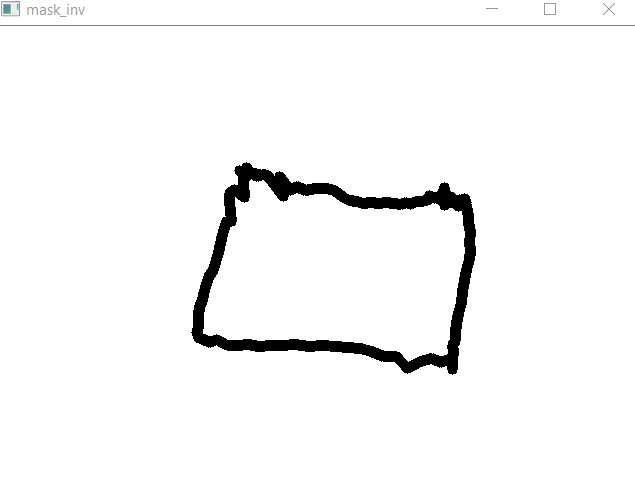
1. Next we black out the area that we have drawn (img2) on image1.  
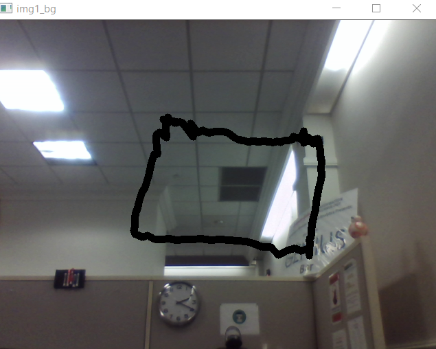
1. Next we get only the areas from img2 that we have drawn on, leaving   the rest of the image black  
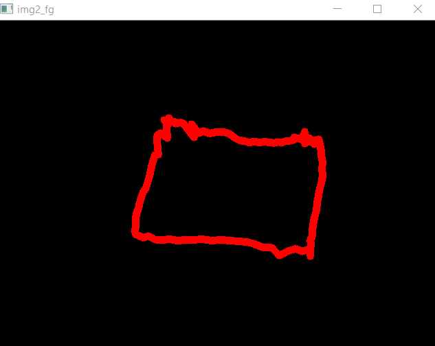
1. Lastly, the `cv2.add()` function combines the img1_bg and img2_fg into the final image  
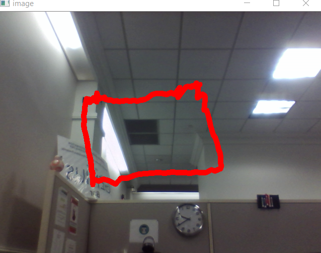
1. Again, in case the images are not the same size, `img1[0:rows, 0:cols] = dst` just puts the overlay of img2 on only a portion of img1.

All we need to do to combine the frame from the camera with the glImg that stores our drawings is to do:
```python
#overlay the camera image and the drawn image
final = overlay(frame, glImg)
```
We can then display this final frame to the user. We do flip this image before displaying using `cv2.flip(final, 1))` so that when you move your hand right to draw, the image also moves your hand to the right so it is not confusing to draw (the default behavior is that the frame displayed from your camera is a mirror image)
    
## UI and Interactivity
Now that we have gone over the tracking and overlaying, the program has all the image processing it needs to work. Now we need to explain how to interact with the user so that they can choose when to draw, how to draw, and what to track.

### Video Capture
In order for any of this to work, we need a way to interface with the camera of the computer running it. This application gets the webcam with ```python
cap = cv2.VideoCapture(0)
```
The parameter 0 tells OpenCV to get the default camera of the system. If there were multiple cameras, different values for that parameter would get different cameras.

In order to read frames from the camera, we do this:
```python
# loop until quit
while(True):
    # get a frame from the camera
    ret, frame = cap.read()
```
`ret` will be an error if something goes wrong, and `frame` is an image of the frame taken from the camera. 

Before ending the application, make sure to call `cap.release()` to release the camera and end the video capture properly.

### Window Management
OpenCV has a system for opening and handling multiple windows at a time. The `cv2.namedWindow(windowname)` function creates a window with a name that can be referenced later. You can move that window with `cv2.moveWindow(windowname, x, y)` to move the top-left corner of the window to (x, y). You can display an image on a named window using `cv2.imshow(windowname, image)`. Lastly, you can close all windows that are currently open using `cv2.destroyAllWindows()`.

# Mouse Events and Callbacks
OpenCV has an event interface to allow you to interact with various events from the user by creating callback functions that are called when events happen. This application uses 2 events, `cv2.EVENT_LBUTTONDOWN` and `cv2.EVENT_LBUTTONUP`. 

The first step is to define your callback function. Our function is here:
```python
#mouse callback function
#just toggles drawing on and off with left mouse clicks
def draw_line(event, x, y, flags, param):
	global glDrawing
	
	if event == cv2.EVENT_LBUTTONDOWN:
		glDrawing = True
		
	if event == cv2.EVENT_LBUTTONUP:
		glDrawing = False
```
We have a variable `glDrawing` that stores whether or not the mouse is being clicked (the application draws on screen whenever you are clicking the mouse). The button up and down events toggle glDrawing.

After you define your callback function, you need to assign it to a window.
```python
cv2.setMouseCallback('image', draw_line)
```
Here we set the `draw_line` callback to be executed with any mouse event on the **image** window.

### Sliders
OpenCV provides built in sliders for user input of various values in this application. Sliders are declared similarly to windows, using this syntax:
```python
cv2.createTrackbar('R', 'settings', 255, 255, nothing)
```
The parameters are:
* The title of the trackbar
* The window it is placed on
* The starting value
* The max value
* A function that is called on every change in the trackbar

Note there is no minimum value specified for trackbars. This is because all trackbars have an explicit minimum value of 0. The `nothing` function that is passed here is just a function that returns immediately since we do not care about doing anything when the user changes slider values.

To get the selected values off of the trackbar, you can store the value in a variable like this:
```python
r = cv2.getTrackbarPos('R', 'settings')
```
where you must specifiy the trackbar name and the window that holds the trackbar.

One example of the use of sliders in this application is a color selector for the drawing pen, which looks like this:
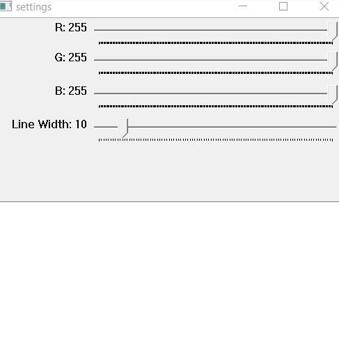

The user can move the RGB slider values as well as the line width to change how they draw over the frames from the webcam.

# Using the Program
You can start the program with just
```bash
$ python draw.py
```
To start, you need to tune the **selector** window in order to capture the object you want to track. The steps are:
1. Use the Hue slider to get to the general color of the object you want to track.
1. Drop the saturation and value sliders to around 40, until you can see your object appear in the **mask** window.
1. In order to remove some of the non-tracking pixels, you can slightly increase the saturation and value sliders.
1. If you are having trouble getting the object you want to track to show up, you can increase the **range** slider or tweak the **hue** slider until you see your object.

After the **mask** window shows just your tracked object, you are ready to draw. You can select your color and line width in the **settings** window. When you want to draw click on the window with your webcam feed. As long as you hold the left mouse button down, you will draw on your screen. To erase, set the R, G, and B sliders all to 0. If you want to clear your drawing, press the escape key. To quit the program, press Q.